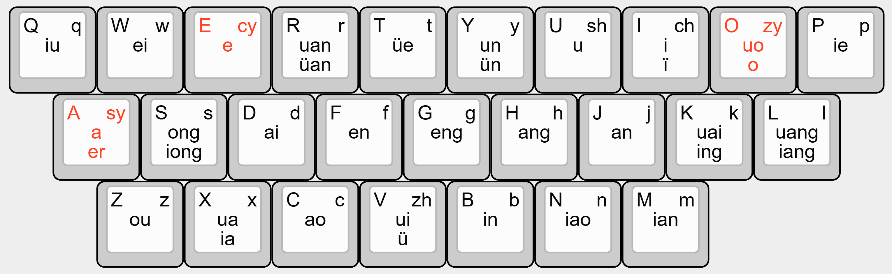
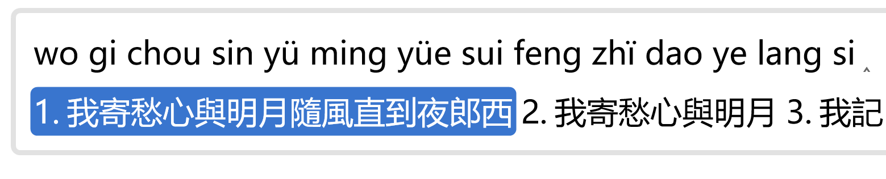

# rime-flypy-ziantuan
一種區分尖團音的小鶴雙拼方案。A flypy double pinyin schema with explicit gi/ki/hi and zi/ci/si distinction.

## 方案說明

本方案設計思路是儘量兼容原有[小鶴雙拼鍵位](https://github.com/rime/rime-double-pinyin)佈局，做最小的改動。韻母的改動會牽一髮而動全身，因此尖團音通過分配三個空餘的零聲母給三個尖音聲母來實現區分。

1. 團音不變，仍用`J`,`Q`,`X`打出。
2. **尖音聲母`zy`, `cy`, `sy`分配三個新按鍵`O`,`E`,`A`。**

如此，小鶴雙拼原有的韻母體系完全保留，只有零聲母的輸入必須做一些妥協。

3. 單鍵和三鍵零聲母輸入方法不變。
4. **雙鍵零聲母的輸入不再兼容全拼輸入，只能通過首字母+所在鍵的方式**。如`ai`只能用`A`+`D`,`en`只能用`E`+`F`來輸入。
5. **`er`音節輸入方法爲`EA`**。因該音節被尖音`cüan`佔用，只能重新分配到`A`鍵，使用`E`+`A`的輸入方式符合上一條的規則。此爲本方案唯一更改原有輸入方式的韻母。

其他兼容（模糊）輸入方式的說明：

6. 單獨的`ü`韻母推薦用`v`輸入，但仍然兼容`u`。如`J`+`U`和`E`+`U`能分別打出`gü`和`zü`。

## 預覽顯示

1. 本方案區分尖團，因此無論聲母，`ü`始終顯示原本的形式。
2. 團音顯示爲`g`,`k`,`h`，尖音顯示爲`z`,`c`,`s`。
3. 爲區分尖音真`i`韻，洪音`ï`用`ï`表示（如`zï`,`zhï`,`rï`等）。

一些效果圖如下。

## 補充說明

1. 尖團字表使用雪齋的[尖團音明月拼音字典](https://github.com/rime-aca/dictionaries)。該字表也區分m韻尾。但涉及韻母的改動勢必會對原本小鶴雙拼方案有較大的改動。因此，以兼容性和簡易爲目的，本方案不支持m韻尾的區分。
2. 使用`O`, `E`, `A`分別代表尖音`jqx`是考慮到保持原來的左右手平衡。
3. 部分雙鍵零聲母如`ao`尚未被佔用，但爲了統一輸入方法，也不再支持全拼的輸入。 